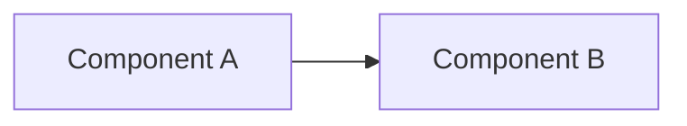

# Architecture view: REPLACE_ME (view name)

> Copy this file, rename it (for example `overview.md`, `data-flow.md`,
> `security-view.md`), and replace every REPLACE_ME. Delete sections that
> genuinely do not apply, but do not delete a section merely because it is
> inconvenient — an empty "Failure modes" section is more honest than a
> missing one.
>
> This is plain GitHub-flavored Markdown. Do not add MDX/Astro/Starlight
> syntax here; this document lives with the code, not in a docs site.

- **Status:** REPLACE_ME (draft / reviewed / current)
- **Last reviewed:** REPLACE_ME (YYYY-MM-DD)
- **Related ADRs:** REPLACE_ME (links into [`../adr/`](../../adr/README.md))

## Audience

REPLACE_ME: who should read this view (for example, engineers operating
this solution, engineers integrating with it, reviewers evaluating a
change).

## Business context

REPLACE_ME: what problem this solution addresses and why, in plain
language. No customer names or confidential details.

## Constraints

REPLACE_ME: constraints that shaped the design (technical, organizational,
regulatory, budgetary, timeline). State the constraint and its source, not
just the outcome.

## System shape

REPLACE_ME: describe the major components and how they interact. Prefer a
diagram (Mermaid, or a linked image) plus a short explanation over prose
alone.

## Security

REPLACE_ME: identity, authorization boundaries, secrets handling, data
classification, and network exposure relevant to this view. Link to ADRs
for anything decided rather than assumed.

## Reliability

REPLACE_ME: availability/durability targets and how they are achieved.
Distinguish a **target** from a **measured** result — measured results
belong in [evidence](../../evidence/README.md), not here.

## Operations

REPLACE_ME: how this part of the system is operated day to day. Link to the
relevant [runbooks](../../runbooks/README.md) rather than duplicating their
content.

## Cost

REPLACE_ME: cost drivers and any cost/performance trade-offs made. Avoid
unverified cost claims; link to an evidence record if you have measured
cost data.

## Failure modes

REPLACE_ME: known ways this part of the system can fail, how failures are
detected, and how they are contained. Link to relevant runbooks.

## Assumptions

REPLACE_ME: assumptions this view depends on that, if wrong, would change
the design. Revisit this list when those assumptions are tested.

## Related ADRs

REPLACE_ME: list the ADRs that produced or constrain this view, linking into
the [ADR index](../../adr/README.md), for example
`../../adr/0001-REPLACE_ME-slug.md`.
